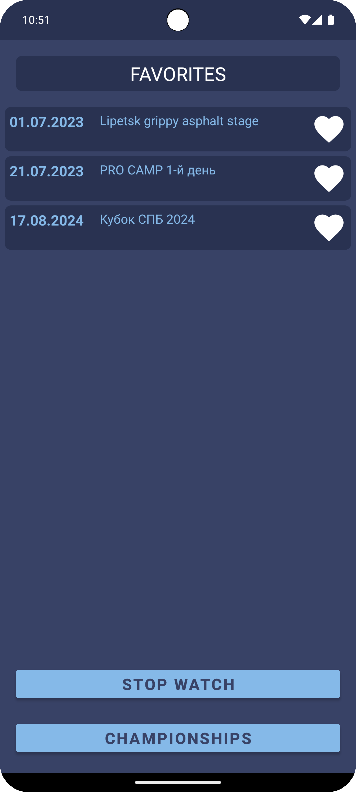
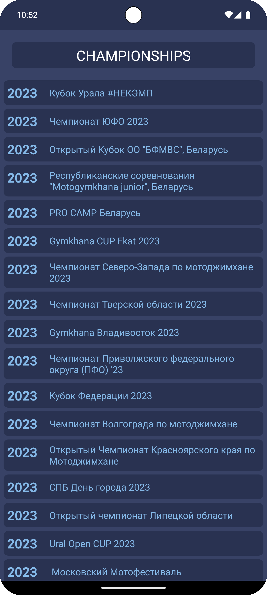
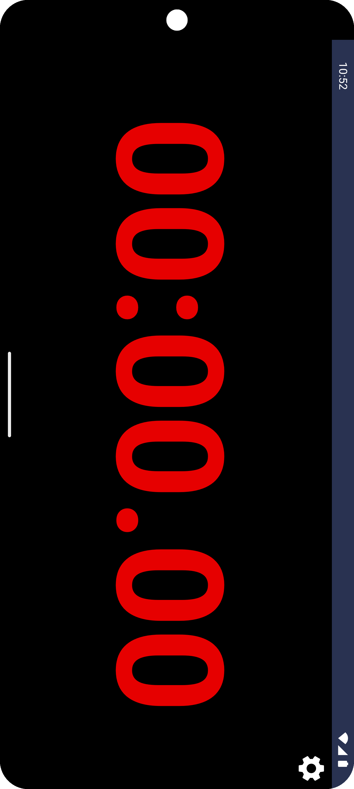
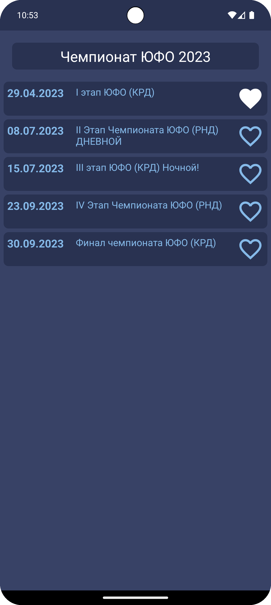
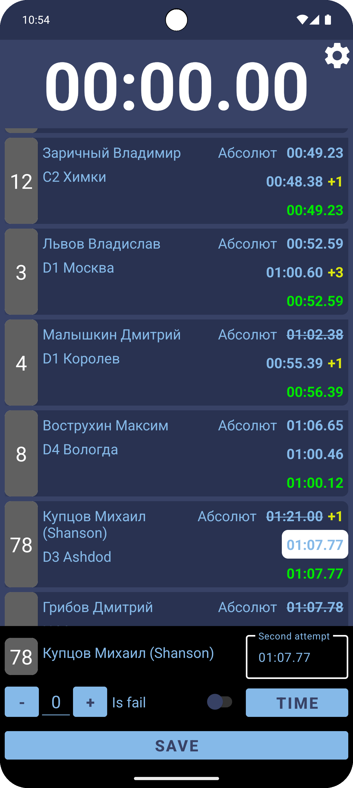
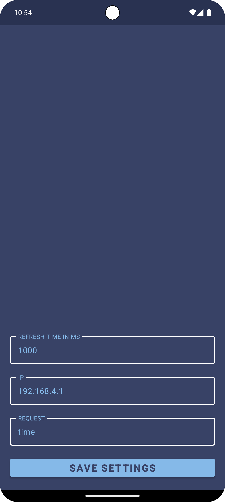

# Moto Gymkhana

App for viewing and editing race results in [moto gymkhana](https://gymkhana-cup.ru/).
It is possible to connect a chronograph.

### Architecture 📐

* MVVM
* [Kotlin](https://kotlinlang.org/)
* [Coroutines](https://github.com/Kotlin/kotlinx.coroutines)
* [Flow](https://kotlinlang.org/docs/flow.html)

### Preview 📷
  
  

### Libraries and tools 🔨

* Navigation component
* ViewModel
* RoomDB
* Hilt
* Retrofit
* OkHttp
* Moshi
* Swipe refresh
* ViewBindingPropertyDelegate